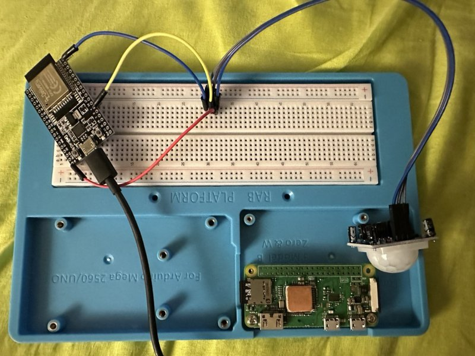
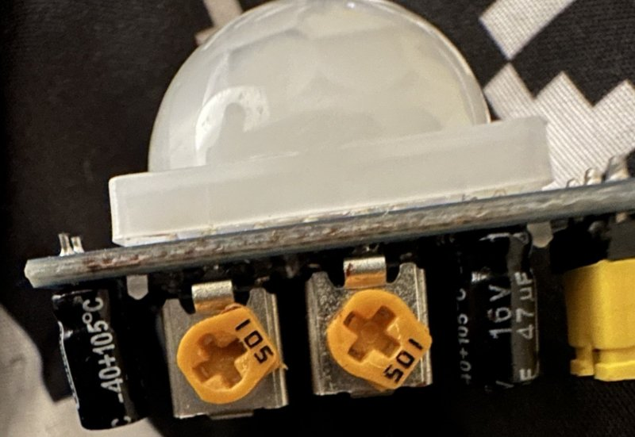

# ESP32 IDF | Motion Detector and Server Notifier (Rust)

Motion Detector and Server Notifier (Rust) is a motion detector application for ESP32 device (should be [this one](https://docs.espressif.com/projects/esp-idf/en/latest/esp32/hw-reference/esp32/get-started-devkitc.html#get-started-esp32-devkitc-board-front)), implemented using Rust programming language, that allows to detect movements and send an alert to a server which will send a notification to a smartphone. **Please refer to the `How to configure and install it?` section if your application does not compiles** (it is a configuration issue).

The server side is still a work in progress. I will push it when it will be ready.

# Architecture

Motion Detector application uses 3 devices:

- led - used for notifying the motion sensor status and application errors. The led is configured to work with GPIO5(Out);
- buzzer - used to emit a sound in order to notify the success of communication with the server after a motion detection. It is configured on GPIO15(Out);
- movement sensor - around which the entire application revolves. It is configured on GPIO4(In).

# How it works?

When the ESP32 is turned on, the application tries to establish an WiFi connection. If the device fails to connect to the WiFi, the application will retry until it succeeds. Then the led will blink one time for one second: this means that the software is configured correctly. Next, ESP32 will try to download the configuration from a remote server, if it does not succeed, then it will load the default configuration.

After a movement detection, a post request is made which contains the MAC address wrapped in a JSON, useful to identify the device that sent the request. If this request was sent successfully then the the led blinks for less that one second and the buzzer emits a short sound. If the request to the server fails, the led blinks for 2 times. The request then is handled by the server, that I wrote using Java (Spring Boot), and a new message is sent to a Discord channel. So that I receive a notification on my smartphone. If the notification was sent successfully, the server sends a positive status, else, a false is returned wrapped in a JSON.
At the beginning of the loop, is sent an ACK to the server that allows to know if the device is online. The ACK time interval is configurable.

# Features

- WiFi auto-reconnection
- customizable
- motion detection alert
- is alive ACK
- download configuration from server

# How to configure and install it?

Before installing the Motion Detector application on a ESP32, it is necessary to rename the `src/config/config.sample.rs` to `src/config/config.rs`. Then you should change the configuration in the `config.rs` by defining your WiFi SSID, password and your remote server alert request handler.
I suppose that the environment is configured correctly, so that in order to run ESP32 Motion Detector application on an ESP32 device just run `cargo clean && cargo build && cargo run` (sometime I succeeded in installing the software by doing a simple `cargo run`, other times i had to hold the boot button of ESP32).

# Photo

### Breadboard

### Sensor settings

I developed this software on Linux (Ubuntu). For more info about how to configure your environment you can take a look [here](https://github.com/goto-eof/esp32-morse-rust/tree/master/morse_esp32).

If you found a bug please contact me [here](https://andre-i.eu/#contactme).
